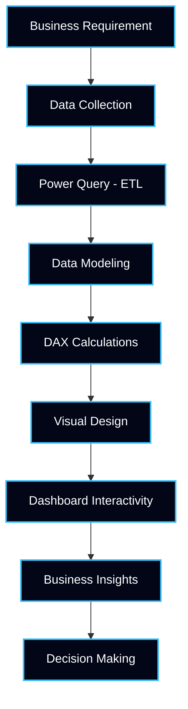

## ✅ UPDATED README (LINKS ONLY MODIFIED)


<!-- ========================================================= -->
<!-- ========== POWER BI – START TECH ACADEMY ================= -->
<!-- ========================================================= -->

<p align="center">
  
</p>

<h1 align="center">📊 Power BI – Start Tech Academy</h1>

<p align="center">
<b>End-to-End Business Intelligence & Data Analytics Learning Repository</b><br>
Transforming <b>raw data into actionable business insights</b> using Microsoft Power BI
</p>

---

## 🚀 Repository Overview

```txt
Program Type     : Business Intelligence & Data Analytics
Platform         : Microsoft Power BI
Level Coverage   : Beginner → Advanced → Industry Projects
Learning Model   : Practical | Dashboard-Oriented | Job-Focused
Outcome          : Industry-Ready Power BI Portfolio
````

---

## 📊 Repository Metrics

<p align="center">


</p>

<p align="center">


</p>

---
---

## 🎯 Learning Objectives (Industry Aligned)

* Understand **business problems through data**
* Build **data models & relationships**
* Write **optimized DAX measures**
* Design **interactive dashboards**
* Create **KPIs for decision-makers**
* Develop **corporate reporting mindset**

---

## 🧠 Power BI Skills Mapping

| Industry Expectation  | Power BI Skill Covered            |
| --------------------- | --------------------------------- |
| Data Preparation      | Power Query (ETL)                 |
| Data Modeling         | Star & Snowflake Schema           |
| Business Calculations | DAX Measures & Calculated Columns |
| Performance Tracking  | KPIs & Metrics                    |
| Visual Storytelling   | Dashboard Design                  |
| Decision Support      | Insight Interpretation            |

---

## 🧩 End-to-End BI Workflow



---

## 🧭 Learning Roadmap (Beginner → Advanced)

```mermaid
flowchart LR

    A[Power BI Basics]:::basic --> B[Data Import]:::basic
    B --> C[Power Query]:::basic

    C --> D[Data Modeling]:::intermediate
    D --> E[DAX Basics]:::intermediate

    E --> F[Advanced DAX]:::advanced
    F --> G[KPIs & Measures]:::advanced

    G --> H[Dashboard Design]:::design
    H --> I[Business Storytelling]:::design

    I --> J[Industry Projects]:::deploy
    J --> K[Portfolio Publishing]:::deploy

    classDef basic fill:#ecfeff,color:#020617,stroke:#06b6d4,stroke-width:2px
    classDef intermediate fill:#fef3c7,color:#78350f,stroke:#f59e0b,stroke-width:2px
    classDef advanced fill:#ede9fe,color:#4c1d95,stroke:#8b5cf6,stroke-width:2px
    classDef design fill:#dcfce7,color:#14532d,stroke:#22c55e,stroke-width:2px
    classDef deploy fill:#fee2e2,color:#7f1d1d,stroke:#ef4444,stroke-width:2px
```



---

## 📁 Repository Structure

```txt
📁 Power_BI_Start_Tech_Academy/
│
├── 📊 Datasets/
│   ├── Sales_Data.xlsx
│   ├── HR_Data.xlsx
│   └── Finance_Data.xlsx
│
├── 📈 Dashboards/
│   ├── Sales_Dashboard.pbix
│   ├── HR_Analytics.pbix
│   └── Finance_KPI.pbix
│
├── 🧮 DAX/
│   ├── Basic_DAX.md
│   ├── Intermediate_DAX.md
│   └── Advanced_DAX.md
│
├── 📘 Notes/
│   ├── Power_Query.md
│   ├── Data_Modeling.md
│   └── Visualization_Best_Practices.md
│
└── 📄 README.md
```

---

## 🧮 Sample DAX Measures (Preview)

```DAX
Total Sales =
SUM(Sales[Sales_Amount])

YoY Growth % =
DIVIDE(
    [Total Sales] - [Previous Year Sales],
    [Previous Year Sales]
)
```

---

## 📊 Dashboard Design Principles Used

* Minimal & professional color themes
* KPI-first layout (Executive View)
* Drill-through & slicer-driven analysis
* Business-focused visuals (not decorative)
* Mobile & report view optimization

---

## 🛠️ Tools & Technologies

| Tool             | Purpose                     |
| ---------------- | --------------------------- |
| Power BI Desktop | Dashboard Development       |
| Power Query      | ETL & Data Cleaning         |
| DAX              | Business Calculations       |
| Excel            | Source Data Preparation     |
| GitHub           | Version Control & Portfolio |

---

## 📌 Final Summary

This repository serves as a **complete Power BI learning & portfolio framework**, demonstrating practical BI skills including data modeling, DAX calculations, KPI creation, dashboard design, and business insight generation—aligned with **real industry expectations**.


## 🧑‍🏫 Author

**Viraj Sawant**
Data Analyst | Power BI Learner | Business Intelligence

<p align="center">
  <a href="https://github.com/Virajsawant21-offcl">
    
  </a>
  <a href="https://www.linkedin.com/">
    
  </a>
</p>
```

---


